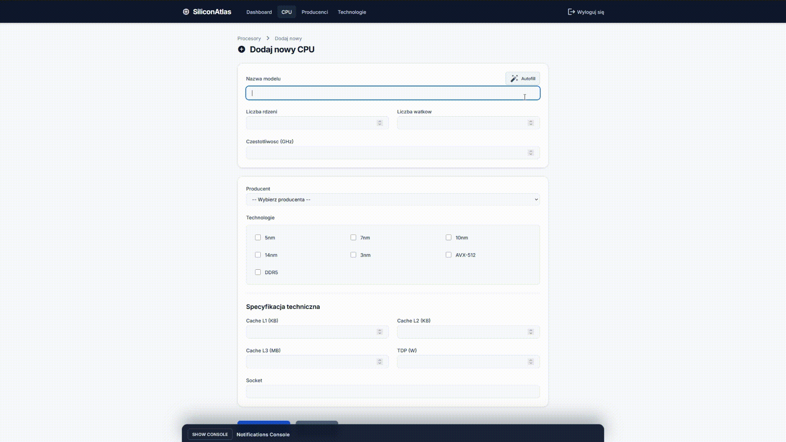

# SiliconAtlas

System do zarzadzania CPU, producentami i technologiami produkcyjnymi z frontendem Angular, backendem Spring Boot oraz eventami real-time przez Kafka + WebSocket.

## Spis tresci

- [Opis projektu](#opis-projektu)
- [Architektura](#architektura)
- [Technologie i wersje](#technologie-i-wersje)
- [AI features](#ai-features)
- [Uruchomienie](#uruchomienie)
- [Frontend Angular](#frontend-angular)
- [Backend API](#backend-api)
- [WebSocket i powiadomienia](#websocket-i-powiadomienia)
- [Testy](#testy)
- [Struktura projektu](#struktura-projektu)

## Opis projektu

SiliconAtlas obsluguje:

- katalog procesorow (CPU)
- producentow i technologie litografii
- benchmarki CPU
- uwierzytelnianie JWT (access + refresh)
- cache w Redis
- event streaming przez Kafka
- powiadomienia real-time przez STOMP/SockJS
- frontend SPA w Angular 19

## Architektura

```text
Angular SPA (frontend-angular)
        |
        | HTTP (REST) + STOMP/SockJS
        v
Spring Boot API (backend-spring-app)
        |
        +--> PostgreSQL (dane glowne)
        +--> Redis (cache)
        +--> Kafka (eventy domenowe)
```

## Technologie i wersje

Wersje ponizej sa zweryfikowane na podstawie plikow konfiguracyjnych projektu (`backend-spring-app/build.gradle`, `frontend-angular/package.json`, `docker-compose.yml`).

### Backend

| Obszar | Technologia | Wersja |
|---|---|---|
| Jezyk | Java | 21 |
| Framework | Spring Boot | 3.5.0 |
| Build | Gradle (wrapper) | 9.2.1 (uzywany w logach buildu) |
| Security | Spring Security starter | zgodnie z BOM Spring Boot 3.5.0 |
| JWT | JJWT | 0.12.3 |
| ORM / Data | Spring Data JPA + Hibernate | zgodnie z BOM Spring Boot 3.5.0 |
| WebSocket | spring-boot-starter-websocket + spring-messaging | zgodnie z BOM Spring Boot 3.5.0 |
| Kafka | spring-kafka + kafka-clients | zgodnie z BOM Spring Boot 3.5.0 |
| OpenAPI | springdoc-openapi-starter-webmvc-ui | 2.8.0 |
| Rate limiting | Bucket4j | 7.6.0 |
| AI | Spring AI Google GenAI starter | 1.1.2 (BOM) |
| Test DB | H2 | 2.2.224 |

### Frontend

| Obszar | Technologia | Wersja |
|---|---|---|
| Framework | Angular | 19.2.x |
| UI | Angular Material + CDK | 19.2.19 |
| Styling | Tailwind CSS | 4.1.12 |
| Rx | RxJS | 7.8.x |
| STOMP | @stomp/stompjs | 7.2.x |
| SockJS | sockjs-client | 1.6.1 |
| TypeScript | TypeScript | 5.7.2 |

### Infrastruktura (Docker Compose)

| Komponent | Technologia | Wersja |
|---|---|---|
| Database | PostgreSQL | 16-alpine |
| Cache | Redis | 7-alpine |
| Messaging | Kafka | confluentinc/cp-kafka:7.5.0 |
| Coordinator | Zookeeper | confluentinc/cp-zookeeper:7.5.0 |
| Frontend runtime | Nginx (image alpine) | latest alpine tag |

## AI features



## Uruchomienie

### 1. Konfiguracja `.env`

Utworz plik `.env` w katalogu glownym, np.:

```properties
# PostgreSQL
POSTGRES_DB=cpu_management
POSTGRES_USER=postgres
POSTGRES_PASSWORD=postgres
POSTGRES_PORT=5432

# Redis
REDIS_PORT=6379

# Ports
FRONTEND_PORT=4200
BACKEND_PORT=8080

# Spring backend
SPRING_DATASOURCE_URL=jdbc:postgresql://postgres:5432/cpu_management
SPRING_DATASOURCE_USERNAME=postgres
SPRING_DATASOURCE_PASSWORD=postgres
SPRING_DATASOURCE_DRIVER_CLASS_NAME=org.postgresql.Driver
SPRING_JPA_HIBERNATE_DDL_AUTO=update
SPRING_JPA_DATABASE_PLATFORM=org.hibernate.dialect.PostgreSQLDialect
SPRING_JPA_SHOW_SQL=false
SPRING_JPA_PROPERTIES_HIBERNATE_FORMAT_SQL=true
SPRING_REDIS_HOST=redis
SPRING_REDIS_PORT=6379
SPRING_PROFILES_ACTIVE=docker

# Optional
GOOGLE_API_KEY=your_key
LOGGING_LEVEL_ROOT=INFO
LOGGING_LEVEL_COM_CPU_MANAGEMENT=DEBUG
```

### 2. Start calego stacku

```bash
docker compose down
docker compose up -d --build
```

### 3. Szybka weryfikacja

```bash
docker compose ps
```

Domyslne URL:

- frontend: http://localhost:4200
- backend API: http://localhost:8080
- swagger: http://localhost:8080/swagger-ui.html

## Frontend Angular

Frontend znajduje sie w katalogu `frontend-angular`.

Najwazniejsze cechy:

- Angular Router i strefa chroniona pod `/app`
- JWT auth (access/refresh token)
- Real-time notyfikacje przez STOMP/SockJS
- Persistowana konsola notyfikacji (localStorage, TTL 24h, max 50)
- UI z Angular Material + Tailwind

Lokalny development frontendu bez Dockera:

```bash
cd frontend-angular
npm install
npm start
```

## Backend API

Backend znajduje sie w katalogu `backend-spring-app`.

Lokalny development backendu bez Dockera:

```bash
cd backend-spring-app
./gradlew bootRun
```

Przykladowe endpointy:

- `POST /api/v1/auth/register`
- `POST /api/v1/auth/login`
- `GET /api/v1/cpus`
- `GET /api/v1/manufacturers`
- `GET /api/v1/technologies`

## WebSocket i powiadomienia

- endpoint SockJS/STOMP: `/ws/events`
- tematy:
  - `/topic/cpu-events`
  - `/topic/technology-events`
  - `/topic/manufacturer-events`
  - `/topic/all-events`
- backend wymaga JWT w naglowku STOMP `Authorization: Bearer <token>` przy CONNECT

## Testy

Uruchomienie testow backendu:

```bash
cd backend-spring-app
./gradlew test
```

Raport HTML:

- `backend-spring-app/build/reports/tests/test/index.html`

## Struktura projektu

```text
CpuManagementSystem/
|- backend-spring-app/
|- frontend-angular/
|- docker-compose.yml
|- scripts/
|- monitoring/
`- README.md
```

## Autor

Dominik Dembski
